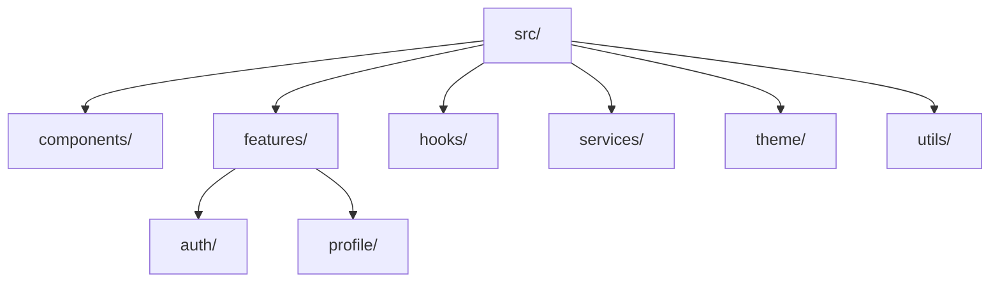

# StorageApp

[](https://www.typescriptlang.org/)
[](https://reactnative.dev/)
[](https://expo.dev/)
[](https://opensource.org/licenses/MIT)
[](https://github.com/prettier/prettier)

A modern React Native application for user authentication, profile management, and settings, built with Firebase, TypeScript, and styled-components. The project follows enterprise-grade best practices, including modular architecture, comprehensive form validation, offline support, and robust testing with Jest, React Testing Library, and Maestro.

## 📑 Table of Contents

- [🚀 Quick Start](#-quick-start)
  - [Expo Development Environment](#expo-development-environment)
  - [Prerequisites](#prerequisites)
  - [Firebase Setup](#firebase-setup)
  - [Setting Up Android Emulator](#setting-up-android-emulator)
  - [Setting Up iOS Emulator](#setting-up-ios-emulator)
  - [Running the App](#running-the-app)
- [🏗 Project Structure](#-project-structure)
- [🧪 Testing](#-testing)
  - [Unit & Integration Tests](#unit--integration-tests)
  - [E2E Tests with Maestro](#e2e-tests-with-maestro)
  - [Accessibility Testing](#accessibility-testing)
  - [Enforcing Test Coverage](#enforcing-test-coverage)
- [🛠 Feature Development Guide](#-feature-development-guide)
  - [Creating a New Feature](#creating-a-new-feature)
  - [Example Feature: User Profile Update](#example-feature-user-profile-update)
- [🎨 Styling Guide](#-styling-guide)
- [🛡 Security](#-security)
  - [Secure Storage](#secure-storage)
  - [Secure API Communication](#secure-api-communication)
  - [Input Validation](#input-validation)
  - [Security Headers (Web)](#security-headers-web)
- [🚀 Performance Optimization](#-performance-optimization)
  - [Code Splitting](#code-splitting)
  - [Image Optimization](#image-optimization)
  - [List Optimization](#list-optimization)
  - [Memory Management](#memory-management)
  - [Performance Monitoring](#performance-monitoring)
- [🤝 Contributing](#-contributing)
  - [Code Style](#code-style)
  - [Code Quality](#code-quality)
  - [Git Workflow](#git-workflow)
- [⚙️ CI/CD Setup](#️-cicd-setup)
- [🐛 Troubleshooting](#-troubleshooting)
  - [Common Issues](#common-issues)
- [🚀 Deployment](#-deployment)
  - [Pre-deployment Checklist](#pre-deployment-checklist)
  - [Android](#android)
  - [iOS](#ios)
  - [Web](#web)
- [📜 Changelog](#-changelog)
- [📝 License](#-license)
- [📞 Support](#-support)

## 🚀 Quick Start

### Expo Development Environment

This project is built with Expo, which provides a set of tools and services for React Native development. Before you begin:

1. **Install Expo CLI** (if not already installed):
   ```bash
   npm install -g expo-cli
   ```

2. **Expo Go App** (for development):
   - Install Expo Go on your physical device from the [App Store](https://apps.apple.com/app/expo-go/id982107779) or [Google Play](https://play.google.com/store/apps/details?id=host.exp.exponent)
   - For the best development experience, we recommend using the Expo Go app on a physical device

3. **Development Builds (Optional but Recommended)**
   For features that require native modules not available in Expo Go, create a development build:
   ```bash
   # Install EAS CLI
   npm install -g eas-cli
   
   # Log in to your Expo account
   eas login
   
   # Configure the project
   eas build:configure
   
   # Build for development
   eas build --profile development --platform android
   # or for iOS
   eas build --profile development --platform ios
   ```

### Prerequisites

- Node.js: v16 or later
- npm or yarn
- Expo CLI: `npm install -g expo-cli`
- Android Studio: For Android development and emulator
  - Android SDK
  - Android SDK Platform
  - Android Virtual Device
- Xcode: For iOS development (macOS only)
- Firebase: Account and project setup (see Firebase Setup)

### Firebase Setup

1. Create a Firebase project in the [Firebase Console](https://console.firebase.google.com/)
2. Add Android and iOS apps to your Firebase project
3. Download `google-services.json` (Android) and `GoogleService-Info.plist` (iOS) files
4. Place these files in the project root or as specified in `app.json`
5. Install Firebase dependencies:
   ```bash
   npm install firebase
   ```
6. Configure environment variables in a `.env` file:
   ```
   FIREBASE_API_KEY=your-api-key
   FIREBASE_AUTH_DOMAIN=your-auth-domain
   FIREBASE_PROJECT_ID=your-project-id
   FIREBASE_STORAGE_BUCKET=your-storage-bucket
   FIREBASE_MESSAGING_SENDER_ID=your-sender-id
   FIREBASE_APP_ID=your-app-id
   ```
7. Initialize Firebase in `src/services/firebase.ts` (example provided in the project)

### Setting Up Android Emulator

1. **Install Android Studio**
   - Download and install [Android Studio](https://developer.android.com/studio)
   - During installation, ensure the following are included:
     - Android SDK
     - Android SDK Platform
     - Android Virtual Device

2. **Create an Android Virtual Device (AVD)**
   - Open Android Studio
   - Go to Tools > AVD Manager
   - Click "Create Virtual Device"
   - Select a device (e.g., Pixel 6) and download a recent system image (API level 30+ recommended)
   - Complete the AVD setup

3. **Start the emulator**
   - From AVD Manager, click the green play button next to your device
   - Alternatively, run: `emulator -avd <your_avd_name>`

### Setting Up iOS Emulator

1. Install Xcode from the Mac App Store
2. Go to Preferences > Locations in Xcode to ensure Command Line Tools are installed
3. Open the Simulator:
   ```bash
   open -a Simulator
   ```
4. Run the app on the iOS simulator:
   ```bash
   npm run ios
   ```

### Running the App

```bash
# Clone the repository
git clone <repo-url>
cd storage-app

# Install dependencies with legacy peer deps to handle version conflicts
npm install --legacy-peer-deps

# Start the development server
npm start

# Run on Android emulator
npm run android

# Run on iOS simulator (macOS only)
npm run ios

# Or scan the QR code with the Expo Go app on a physical device
```

> **Note:** Ensure the Android emulator or iOS simulator is running before executing `npm run android` or `npm run ios`. Use `--legacy-peer-deps` to resolve peer dependency conflicts. For specific versions, see `package.json` (Expo SDK 51, React Native 0.74).

## 🏗 Project Structure

```
storage-app/
├── src/
│   ├── components/common/           # Reusable UI components
│   │   ├── Button/                 # Button component with variants
│   │   ├── Input/                  # Form input with validation
│   │   └── ...
│   ├── features/                   # Feature modules
│   │   ├── auth/                   # Authentication flows
│   │   ├── profile/                # User profile management
│   │   └── ...
│   ├── hooks/                      # Custom React hooks
│   ├── services/                   # API and business logic
│   ├── theme/                      # Theme configuration
│   └── utils/                      # Utility functions
├── tests/                          # Test files
│   ├── unit/                       # Unit tests
│   └── e2e/                        # E2E test scenarios
└── .maestro/                       # Maestro E2E test flows
```

### Visual Project Structure



### Key Directories

- **components/common/**: Reusable UI components following atomic design principles
- **features/**: Self-contained feature modules with their own components, hooks, and services
- **hooks/**: Custom React hooks for shared logic
- **services/**: API clients, Firebase integration, and business logic
- **theme/**: Design tokens, colors, typography, and theming utilities
- **tests/**: Test files organized by test type (unit, integration, e2e)
- **.maestro/**: End-to-end test flows for critical user journeys

## 🧪 Testing

### Unit & Integration Tests

We use Jest and React Testing Library for comprehensive testing. Follow these guidelines:

#### Running Tests

```bash
# Run all tests
npm test

# Run tests in watch mode
npm test -- --watch

# Run tests with coverage
npm test -- --coverage

# Run a specific test file
npm test -- src/features/auth/screens/__tests__/LoginScreen.test.tsx

# Run tests matching a pattern
npm test -- -t "login form"
```

#### Testing Guidelines

1. **Test Structure**
   - Place test files in `__tests__` directories next to the code they test
   - Use `.test.tsx` extension for test files
   - Follow the naming convention: `ComponentName.test.tsx`
   - Group related tests with `describe` blocks
   - Use `it` or `test` for individual test cases

2. **Test Coverage**
   - Aim for at least 80% test coverage
   - Focus on testing behavior, not implementation
   - Test edge cases and error states
   - Cover all user flows and business logic

3. **Best Practices**
   - Use `@testing-library/react-native` for rendering components
   - Mock external dependencies with `jest.mock()`
   - Test user interactions with `fireEvent`
   - Use `waitFor` for async operations
   - Keep tests isolated and independent
   - Use descriptive test names
   - Follow the Arrange-Act-Assert pattern

4. **Example Test**
   ```typescript
   import { render, fireEvent, waitFor } from '@testing-library/react-native';
   import { LoginScreen } from '../LoginScreen';
   import { AuthProvider } from 'contexts/AuthContext';

   describe('LoginScreen', () => {
     const mockSignIn = jest.fn();
     
     beforeEach(() => {
       jest.clearAllMocks();
     });

     it('should show error with invalid credentials', async () => {
       // Arrange
       mockSignIn.mockRejectedValue(new Error('Invalid credentials'));
       
       // Act
       const { getByPlaceholderText, getByText } = render(
         <AuthProvider value={{ signIn: mockSignIn }}>
           <LoginScreen />
         </AuthProvider>
       );
       
       fireEvent.changeText(getByPlaceholderText('Email'), 'test@invalid.com');
       fireEvent.changeText(getByPlaceholderText('Password'), 'wrongpass');
       fireEvent.press(getByText('Sign In'));
       
       // Assert
       await waitFor(() => {
         expect(mockSignIn).toHaveBeenCalledWith('test@invalid.com', 'wrongpass');
         expect(getByText('Invalid email or password')).toBeTruthy();
       });
     });
   });
   ```

### E2E Tests with Maestro

Maestro is used for end-to-end testing of critical user flows.

#### Installation

```bash
# Install Maestro CLI
curl -Ls "https://get.maestro.mobile.dev" | bash

# Verify installation
maestro --version
```

#### Running Tests

```bash
# Run all test flows
maestro test .maestro/tests/

# Run specific test suite
maestro test .maestro/tests/auth/login_flow.yaml

# Record a new test (interactive)
maestro studio
```

#### Example Test Flow

```yaml
# .maestro/tests/auth/login_flow.yaml
appId: com.yourapp.storageapp

- launchApp
- assertVisible: "Welcome to StorageApp"
- tapOn: "Sign In"
- inputText: "test@example.com"
- tapOn: "Password"
- inputText: "password123"
- tapOn: "Sign In"
- assertVisible: "Welcome back, Test User!"
```

### Accessibility Testing

#### Key Principles

1. **Semantic Markup**
   - Use appropriate component types (Button, TextInput, etc.)
   - Add `accessibilityLabel` for interactive elements
   - Use `accessibilityRole` to describe the purpose

2. **Screen Reader Support**
   - Test with VoiceOver (iOS) and TalkBack (Android)
   - Ensure logical reading order
   - Provide meaningful announcements for dynamic content

3. **Focus Management**
   - Ensure all interactive elements are focusable
   - Manage focus for modal dialogs and navigation
   - Use `accessibilityElementsHidden` and `importantForAccessibility`

#### Example Component

```tsx
<Button
  accessibilityLabel="Submit form"
  accessibilityRole="button"
  accessibilityHint="Saves your profile information"
  onPress={handleSubmit}
>
  <Text>Submit</Text>
</Button>
```

#### Testing Accessibility

```typescript
import { render } from '@testing-library/react-native';
import { Button } from '../Button';

describe('Button Accessibility', () => {
  it('has correct accessibility props', () => {
    const { getByA11yLabel } = render(
      <Button 
        accessibilityLabel="Submit form"
        onPress={jest.fn()}
      >
        Submit
      </Button>
    );
    
    const button = getByA11yLabel('Submit form');
    expect(button).toHaveProp('accessibilityRole', 'button');
    expect(button).toHaveProp('accessible', true);
  });
});
```

### Enforcing Test Coverage

Test coverage thresholds are enforced via Jest configuration in `package.json`:

```json
"jest": {
  "coverageThreshold": {
    "global": {
      "branches": 80,
      "functions": 80,
      "lines": 80,
      "statements": 80
    }
  }
}
```

#### Viewing Coverage

```bash
# Generate coverage report
npm test -- --coverage

# View HTML report
open coverage/lcov-report/index.html
```

#### CI Integration

Coverage reports are generated in CI pipelines and can be integrated with services like:
- Codecov
- Coveralls
- SonarQube

Example GitHub Actions workflow:

```yaml
# .github/workflows/test.yml
name: Test

on: [push, pull_request]

jobs:
  test:
    runs-on: ubuntu-latest
    steps:
      - uses: actions/checkout@v2
      - uses: actions/setup-node@v2
        with:
          node-version: '16'
      - run: npm ci
      - run: npm test -- --coverage --coverageReporters=text-lcov | npx coveralls
        env:
          COVERALLS_REPO_TOKEN: ${{ secrets.COVERALLS_TOKEN }}
```

### Test Coverage
We maintain a minimum of 80% test coverage. To check current coverage:

```bash
npm test -- --coverage
```

### Test Generation Prompt

For generating new test files, use the following prompt template:

```markdown
# React Native Screen Test Case Generation

## Component Information
- **Component Name**: [ComponentName]
- **File Path**: [path/to/ComponentName.tsx]
- **Description**: [Brief description of what the component does]

## Testing Requirements
1. Test Setup with proper mocks for navigation, context, and services
2. Test cases for rendering, navigation, user interactions, data display, accessibility, and theming
3. Proper TypeScript types for all test variables and functions
4. Comprehensive test coverage for both happy paths and error cases
5. Follow the project's existing testing patterns and conventions
```

### Example Test File

See these reference implementations for examples:
- `src/features/auth/screens/__tests__/LoginScreen.test.tsx`
- `src/features/auth/screens/__tests__/SignupScreen.test.tsx`
- `src/features/profile/screens/__tests__/ProfileScreen.test.tsx`

## 🛠 Feature Development Guide

### Creating a New Feature

Follow this structured approach when adding new features to maintain consistency and quality:

#### Feature Request Template

```markdown
## Feature: [Feature Name]

### Description
[Clear, concise description of the feature and its purpose]

### Business Value
[How this feature adds value to users and the business]

### User Stories
- As a [user role], I want to [action] so that [benefit]
- [Additional user stories as needed]

### Technical Requirements
- [ ] API endpoints needed
- [ ] New components required
- [ ] State management updates
- [ ] Testing requirements
  - [ ] Unit tests
  - [ ] Integration tests
  - [ ] E2E tests
- [ ] Documentation updates
  - [ ] API documentation
  - [ ] User guides
  - [ ] In-app help

### Design Assets
- [ ] Figma/Sketch links
- [ ] Screen flows
- [ ] Asset requirements

### Acceptance Criteria
- [ ] Criteria 1 (SMART - Specific, Measurable, Achievable, Relevant, Time-bound)
- [ ] Criteria 2
- [ ] ...

### Technical Notes
- Dependencies and potential impacts
- Performance considerations
- Security implications
- Accessibility requirements
- Internationalization needs
- Offline behavior
- Error handling strategy
- Analytics requirements
- A/B testing requirements

### Open Questions
- [ ] Any unresolved questions or decisions needed
```

### Development Workflow

1. **Create a Feature Branch**
   ```bash
   # Create and switch to a new branch
   git checkout -b feature/feature-name
   ```

2. **Set Up Development Environment**
   - Update dependencies if needed
   - Create necessary feature flags
   - Set up any required environment variables

3. **Implement the Feature**
   - Follow the project's code style and architecture
   - Write clean, maintainable code with comments
   - Add TypeScript types and interfaces
   - Implement error handling and edge cases

4. **Testing**
   ```bash
   # Run unit tests
   npm test
   
   # Run E2E tests
   maestro test .maestro/tests/feature-name/
   ```
   - Write tests for all new functionality
   - Update existing tests if needed
   - Ensure test coverage meets project standards

5. **Documentation**
   - Update README files
   - Add JSDoc comments for public APIs
   - Document any breaking changes
   - Update the CHANGELOG.md

6. **Code Review**
   ```bash
   # Stage changes
   git add .
   
   # Commit with semantic message
   git commit -m "feat(feature-name): add new feature"
   
   # Push to remote
   git push origin feature/feature-name
   ```
   - Create a pull request
   - Request reviews from relevant team members
   - Address all review comments

7. **Deployment**
   - Merge to main branch after approval
   - Follow the deployment process
   - Verify the feature in staging/production
   - Monitor for any issues

### Example Feature: User Profile Update

#### Project Context
Allow users to update their profile information (name, email, avatar) and save it to Firebase Firestore.

#### Feature Requirements

**Core Functionality:**
- Update user profile data in Firestore
- Upload and crop profile pictures
- Form validation for all fields
- Offline support with optimistic updates
- Real-time sync across devices

**Key Screens:**
1. `ProfileScreen`: Displays current profile info
2. `EditProfileScreen`: Form for editing profile
3. `AvatarPicker`: Component for selecting/uploading photos

**Data Model:**
```typescript
interface UserProfile {
  uid: string;
  displayName: string;
  email: string;
  photoURL?: string;
  phoneNumber?: string;
  lastUpdated: Date;
  metadata: {
    creationTime?: string;
    lastSignInTime?: string;
  };
}
```

#### Implementation Details

**File Structure**
```
src/
├── features/
│   └── profile/
│       ├── components/
│       │   ├── AvatarEditor.tsx
│       │   ├── ProfileForm.tsx
│       │   └── ProfileView.tsx
│       ├── screens/
│       │   ├── EditProfileScreen.tsx
│       │   └── ProfileScreen.tsx
│       ├── hooks/
│       │   └── useProfile.ts
│       ├── services/
│       │   └── profileService.ts
│       ├── types/
│       │   └── profile.types.ts
│       ├── __tests__/
│       │   ├── ProfileForm.test.tsx
│       │   ├── ProfileScreen.test.tsx
│       │   └── profileService.test.ts
│       └── index.ts
```

**Example Service**
```typescript
// src/features/profile/services/profileService.ts
import { doc, updateDoc } from 'firebase/firestore';
import { getDownloadURL, ref, uploadBytes } from 'firebase/storage';
import { db, storage } from 'src/services/firebase';

export const updateProfile = async (
  userId: string, 
  updates: Partial<UserProfile>
): Promise<void> => {
  const userRef = doc(db, 'users', userId);
  await updateDoc(userRef, {
    ...updates,
    lastUpdated: new Date().toISOString()
  });};

export const uploadProfileImage = async (
  userId: string, 
  file: Blob
): Promise<string> => {
  const storageRef = ref(storage, `profile-images/${userId}`);
  const snapshot = await uploadBytes(storageRef, file);
  return getDownloadURL(snapshot.ref);
};
```

**Testing Requirements**

1. **Unit Tests**
   - Form validation
   - Service methods
   - Custom hooks

2. **Component Tests**
   - Form submission
   - Error states
   - Loading states
   - Avatar upload flow

3. **Integration Tests**
   - Profile update flow
   - Data persistence
   - Error handling

4. **E2E Tests**
   - Complete profile update journey
   - Offline behavior
   - Image upload

**Accessibility**
- Screen reader support
- Keyboard navigation
- Sufficient color contrast
- Dynamic text sizing

**Performance**
- Image optimization
- Lazy loading
- Efficient Firestore queries
- Minimal re-renders

### 🎯 Feature Implementation Template

Use this template when implementing new features to maintain consistency with the project's architecture and best practices:

You are a senior frontend engineer experienced in TypeScript, React Native, and modular app architecture of Expo.
I want you to help me scaffold a new feature implementation following a structured template.

Use the format below to describe the new feature implementation plan: 
```markdown
# [Feature Name] Implementation

## Project Context
[Briefly describe the feature and its purpose]

## Feature Requirements
1. Core functionality:
   - [List main functionality points]
   - [Include user stories if applicable]

2. Key screens:
   - [List all screens needed]

3. Data model:
   - [Describe the data structure]
   - [Include Firestore schema if applicable]

## Implementation Details

### File Structure
src/features/[feature-name]/
  ├── components/     # Reusable UI components
  ├── screens/        # Screen components
  ├── hooks/          # Custom hooks
  ├── services/       # API/services
  ├── types/          # TypeScript types
  ├── __tests__/      # Unit/Integration tests
  └── index.ts        # Public API exports

### Theme Integration
typescript
// Use these theme properties:
const styles = styled.View`
  background-color: ${({ theme }) => theme.colors.background};
  padding-horizontal: ${({ theme }) => theme.spacing.md};
  padding-vertical: ${({ theme }) => theme.spacing.sm};
`;

### Testing Requirements

1. **Unit Tests**: Test components, hooks, and utilities
2. **Integration Tests**: Test component interactions
3. **E2E Tests**: Add Maestro test flows

### Example Implementation
For reference, see these features:
- `src/features/auth/` - Authentication flows
- `src/features/profile/` - User profile management


### Component Development

1. **File Structure**
   
   ComponentName/
   ├── ComponentName.tsx        # Main component
   ├── ComponentName.styles.ts  # Styled components
   ├── ComponentName.test.tsx   # Tests
   └── index.ts                 # Exports

2. **Example Component**
   ```tsx
   // Button/Button.tsx
   import React from 'react';
   import { ButtonProps } from './Button.types';
   import * as S from './Button.styles';

   export const Button: React.FC<ButtonProps> = ({
     children,
     variant = 'primary',
     ...props
   }) => {
     return (
       <S.ButtonContainer variant={variant} {...props}>
         <S.ButtonText>{children}</S.ButtonText>
       </S.ButtonContainer>
     );
   };
   

### State Management

- Use React Context for global state
- Keep state as local as possible
- Use custom hooks for reusable state logic

### Testing Guidelines

1. **Test Structure**
   typescript
   describe('Button Component', () => {
     it('renders correctly', () => {
       const { getByText } = render(<Button>Test</Button>);
       expect(getByText('Test')).toBeTruthy();
     });
   });


2. **Test Coverage**
   - Test component rendering
   - Test user interactions
   - Test edge cases
   - Test error states
```
## 📚 Development & Testing Guidelines

For comprehensive development and testing guidelines, please refer to our [Development and Testing Guidelines](./DEVELOPMENT_GUIDELINES.md) document. This document covers:

- Project architecture and folder structure
- React Native styling best practices
- Firebase integration guidelines
- TypeScript migration strategy
- Testing and quality assurance
- Internationalization (i18n)
- Error handling and debugging
- Performance optimization
- Code organization and maintenance
- Team workflow and standards

## 🤝 Contributing

### Code Style

- Follow TypeScript best practices
- Use meaningful variable names
- Add comments for complex logic
- Keep components small and focused

## 🐛 Troubleshooting

### Common Issues

1. **Build Failures**
   ```bash
   # Clear Metro cache
   npm start -- --reset-cache
   
   # Reinstall node_modules
   rm -rf node_modules
   npm install
   ```

2. **iOS Build Issues**
   ```bash
   cd ios
   pod install
   cd ..
   ```

## 🚀 Deployment

### Pre-deployment Checklist

1. **Version Bumping**
   - Update version in `app.json`
   - Update build numbers
   - Update CHANGELOG.md

2. **Testing**
   - [ ] All tests passing
   - [ ] E2E tests verified
   - [ ] Performance tested
   - [ ] Accessibility verified

3. **Documentation**
   - [ ] API documentation updated
   - [ ] Changelog updated
   - [ ] Release notes prepared

### Android

1. **Build Configuration**
   ```bash
   # Update version in app.json
   {
     "expo": {
       "version": "1.0.0",
       "android": {
         "versionCode": 10000, // Format: MMMmmpp (M=major, m=minor, p=patch)
         "package": "com.yourapp.storage"
       }
     }
   }
   ```

2. **Build Commands**
   ```bash
   # Build APK for testing
   eas build --platform android --profile preview
   
   # Build AAB for Play Store
   eas build --platform android --profile production
   ```

3. **Publish to Play Store**
   - Create a release in Google Play Console
   - Upload the AAB file
   - Fill in release notes
   - Roll out to testers or production

### iOS
1. Open `ios/YourApp.xcworkspace` in Xcode
2. Select the target device
3. Click "Product" > "Archive"
4. Follow the prompts to upload to TestFlight

## 📝 License

This project is licensed under the MIT License - see the [LICENSE](LICENSE) file for details.

---

<div align="center">
  Made with ❤️ by [Your Team Name]
</div>
